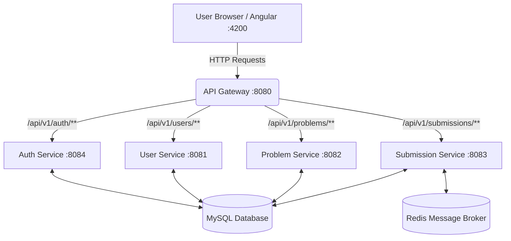
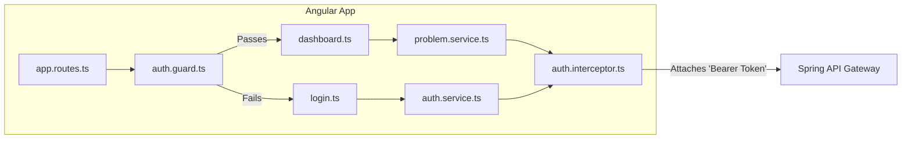
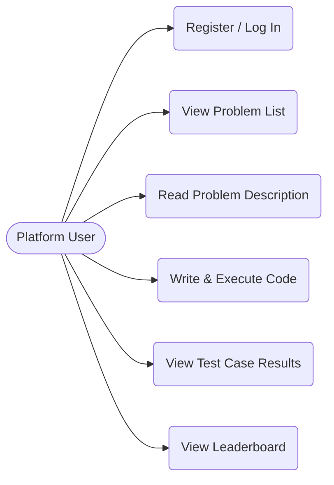
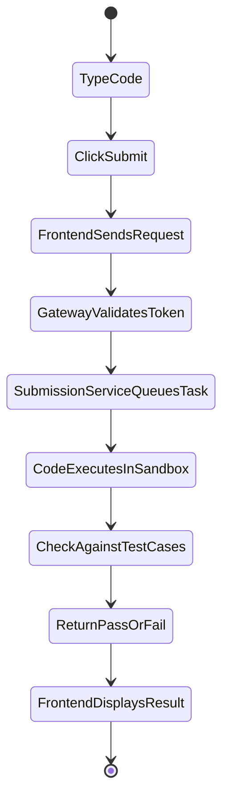
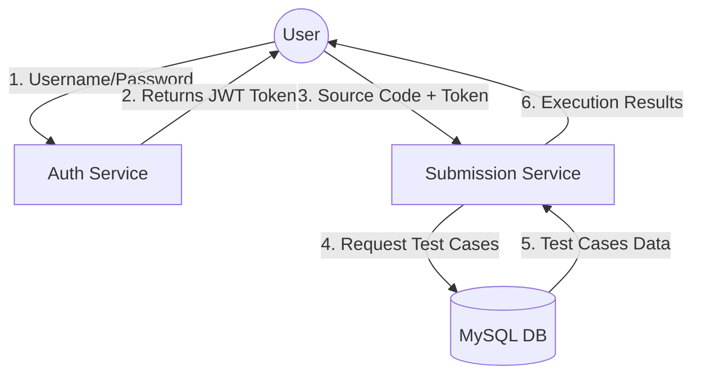
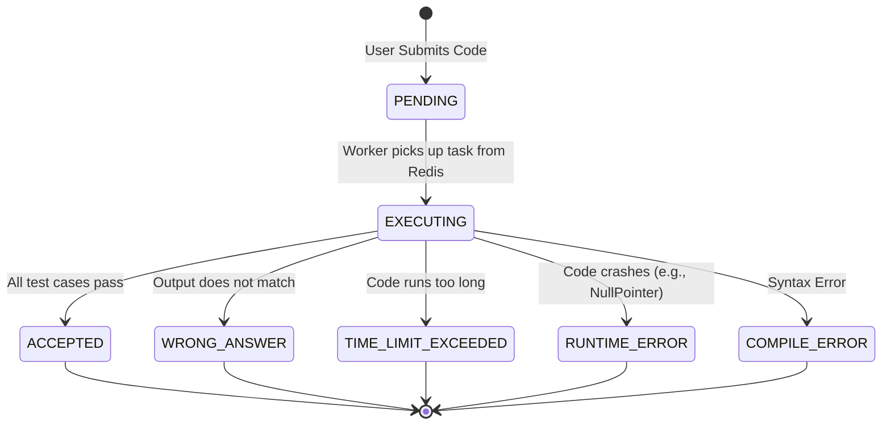

# DevGraph: Interactive Coding Platform

DevGraph is a portfolio-grade, full-stack microservices application designed as a coding platform (similar to LeetCode or HackerRank). It allows users to log in, view coding problems, submit solutions, and see their results in real-time.

---

## 1. Implementation Idea & System Design

**Implementation Idea:** 
To build a scalable, highly-available coding platform where code execution, user authentication, and problem management are decoupled into independent microservices. This prevents a heavy code-execution task (like an infinite loop submitted by a user) from crashing the entire website for other users.

**System Design:**
The system uses a **Microservices Architecture** backend and a **Single Page Application (SPA)** frontend.
- **API Gateway (Port 8080):** The single entry point. Handles CORS and routes traffic to the correct microservice.
- **Auth Service (Port 8084):** Generates and validates JSON Web Tokens (JWTs).
- **User Service (Port 8081):** Manages user profiles and registration data.
- **Problem Service (Port 8082):** Manages coding problems, descriptions, difficulty levels, and test cases.
- **Submission Service (Port 8083):** Handles the queue and execution logic for submitted code.

---

## 2. Tech Stack

*   **Frontend:** Angular (v21, Zoneless), Tailwind CSS v3, TypeScript, RxJS.
*   **Backend:** Java 21, Spring Boot 3, Spring Cloud Gateway.
*   **Database:** MySQL (Relational Data), Redis (Caching & Message Queuing).
*   **Infrastructure:** Docker & Docker Compose.

---

## 3. New Terminologies

*   **Microservices:** Breaking down a giant backend into smaller, independent applications that talk to each other over the network.
*   **API Gateway:** A "traffic cop" server that sits in front of all microservices and routes incoming requests.
*   **JWT (JSON Web Token):** A secure, encrypted string given to a user after they log in. It acts as a digital VIP pass for future requests.
*   **SPA (Single Page Application):** A website that only has one actual HTML file. It uses JavaScript to instantly swap out UI components.
*   **Interceptor:** A frontend script that catches HTTP requests right before they leave the browser and modifies them (e.g., attaching the JWT).
*   **Guard (AuthGuard):** A frontend script that acts like a bouncer, preventing unauthenticated users from viewing specific pages.

---

## 4. Comprehensive Week-to-Week & Day-to-Day Plan

### [x] Week 1: Architecture & Backend Services Setup
*   [x] **Day 1:** System Design & Architecture planning. We defined the Microservice structure, mapped out database schemas for Users and Problems, and decided on Docker for deployment.
*   [x] **Day 2:** Initialize Spring Boot projects. We successfully scaffolded `user-service`, `auth-service`, `problem-service`, `submission-service`, and the `api-gateway` using Spring Initializr.
*   [x] **Day 3:** Set up Git repository & structure. We organized the monorepo into `client/` and `server/` folders for clean separation of concerns.
*   [x] **Day 4:** Write basic REST Controllers. We created placeholder endpoints across all microservices to test that they can boot up and receive traffic.
*   [x] **Day 5:** Configure cross-service properties. We set up `application.properties` and `.yml` files to define ports (`8080`, `8081`, `8082`, etc.) and basic configurations.

### [x] Week 2: Database & API Gateway Integration
*   [x] **Day 1:** Write `docker-compose.yml`. We successfully wrote the configuration to spin up isolated MySQL and Redis containers.
*   [x] **Day 2:** Connect Services to MySQL. We wired the `user-service` and `problem-service` to the database using Spring Data JPA for persistent storage.
*   [x] **Day 3:** Connect to Redis. We configured the `submission-service` to talk to Redis, which will later be used for queuing code execution tasks.
*   [x] **Day 4:** Configure API Gateway Routes. We updated the gateway's `application.yml` to securely route frontend traffic to the correct backend microservices.
*   [x] **Day 5:** Configure Global CORS. We solved the cross-origin browser issues by allowing our Angular app (`localhost:4200`) to communicate with the gateway (`localhost:8080`).

### [x] Week 3: Frontend Foundation & Authentication Flow
*   [x] **Day 1:** Scaffold Angular. We generated the modern, Zoneless Angular 21 client application.
*   [x] **Day 2:** Configure Tailwind CSS & Build Login UI. We built a beautiful, dark-mode Tailwind CSS login screen (`LoginComponent`).
*   [x] **Day 3:** Build `AuthService`. We connected the Login UI to the backend `/api/v1/auth/login` endpoint to successfully retrieve a JWT token.
*   [x] **Day 4:** Implement `AuthGuard`. We successfully protected the `/dashboard` route so only authenticated users with a token can view it.
*   [x] **Day 5:** Implement `AuthInterceptor`. We wrote an interceptor to secretly attach the `Authorization: Bearer <token>` header to all outgoing requests.

### [ ] Week 4: Dashboard UI & Dynamic Data (CURRENTLY HERE)
*   [x] **Day 1:** Build the Dashboard HTML layout. We created a sleek Sidebar and Main Content table for viewing problems. *(Almost done!)*
*   [x] **Day 2:** Build `ProblemService`. We wrote the TypeScript service to fetch the list of coding problems from our backend.
*   [ ] **Day 3:** Dynamic Rendering. We need to use Angular's `@for` loop in the HTML to instantly render table rows for every problem sent by the backend.
*   [ ] **Day 4:** Error Handling & Loading states. Add visual spinners and error popups to provide a smooth user experience.
*   [ ] **Day 5:** Refine the UI. We will add hover effects, and color-coded status indicators (e.g., "Solved" in green).

### [ ] Week 5: Code Editor Workspace
*   [ ] **Day 1:** Create `WorkspaceComponent`. Design a split-screen view with the problem description on the left and the editor on the right.
*   [ ] **Day 2:** Integrate Monaco Editor. We will install and configure the exact same code editor engine that powers VS Code inside our web app.
*   [ ] **Day 3:** Fetch Single Problem Data. Wire up the UI to fetch detailed descriptions, difficulty, and starter code for a specific problem by its ID.
*   [ ] **Day 4:** Build Submission Logic. We will write the frontend logic to capture the user's typed code and send it to the backend `submission-service`.
*   [ ] **Day 5:** UI Response Handling. Design the terminal output window to show users if they got a syntax error, runtime error, or if they successfully passed.

### [ ] Week 6: Code Execution & Leaderboard
*   [ ] **Day 1:** (Backend) Execution Sandbox. We will implement Docker-in-Docker or an isolated runtime to securely execute user code without risking our servers.
*   [ ] **Day 2:** (Backend) Test Case Verification. We will write the logic to compile the code, feed it hidden test cases from the database, and verify the outputs match.
*   [ ] **Day 3:** Build Leaderboard UI. We will fetch a list of top users based on problems solved and render a competitive leaderboard.
*   [ ] **Day 4:** Final Polish. Add micro-animations, transitions, and finalize the dark-mode aesthetic across the entire app.
*   [ ] **Day 5:** Deployment. Prepare the codebase for portfolio deployment (e.g., packaging into Docker containers and setting up CI/CD).

---

## 5. Team Profiles

Even though you are building this solo, here is the professional breakdown of who does what:

**1. Backend Engineer (Alice)**
*   *Week 1-2:* Created the Java/Spring Boot microservices, configured MySQL schemas, and built the API Gateway.
*   *Week 3-4:* Securing the backend endpoints and ensuring the gateway properly validates JWTs.
*   *Week 5-6:* Developing the complex, isolated code execution sandbox in the `submission-service`.

**2. Frontend Engineer (Bob)**
*   *Week 1-2:* Scaffolded Angular, set up Tailwind CSS, and wireframed the application.
*   *Week 3-4:* Built the Login/Dashboard views, wrote Auth Guards, Interceptors, and connected UI to Alice's REST APIs.
*   *Week 5-6:* Integrating the Monaco Code Editor and building the real-time submission results UI.

**3. DevOps / Architecture (Charlie)**
*   *Week 1-2:* Designed the microservice architecture diagram and managed the `docker-compose` networking.
*   *Week 3-6:* Managing Redis queues, monitoring system health, and ensuring the code-execution engine runs safely in isolated containers.

---

## 6. Project Architecture & Diagrams

Yes, your project **actually has** all of these moving parts! The diagrams below have been expanded to show the exact files, services, and logic that exist (or will exist) in the DevGraph repository.

### A. Overall Implementation Flow
This graph shows the physical layout of your servers and databases.

### B. Component Diagram (Frontend Internal Structure)
This shows the exact structure of the Angular app you are writing.

### C. Use Case Diagram
This maps out what a user can physically do on the platform.

### D. Activity Diagram (Submission Flow)
This tracks the step-by-step logic when you click the "Submit Code" button.

### E. Data Flow Diagram (DFD)
This shows how data (Credentials, Tokens, Code, Results) moves between the entities.

### F. State Diagram (A Single Code Submission)
This tracks the "State" of a code submission from the database's perspective.

